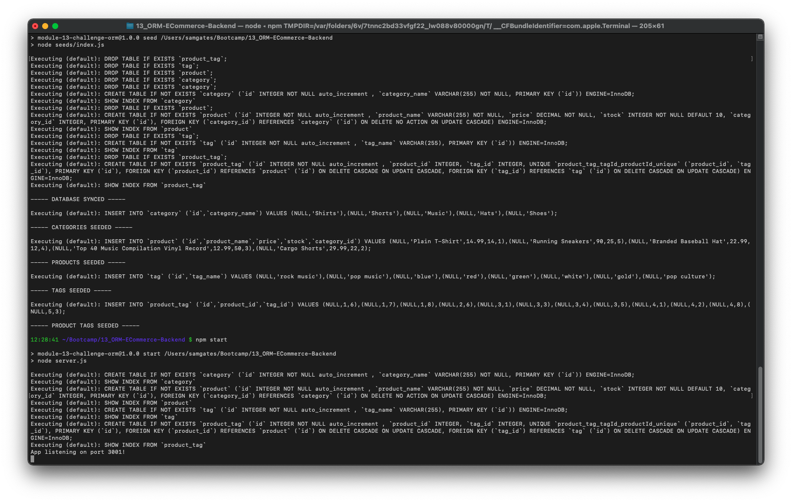
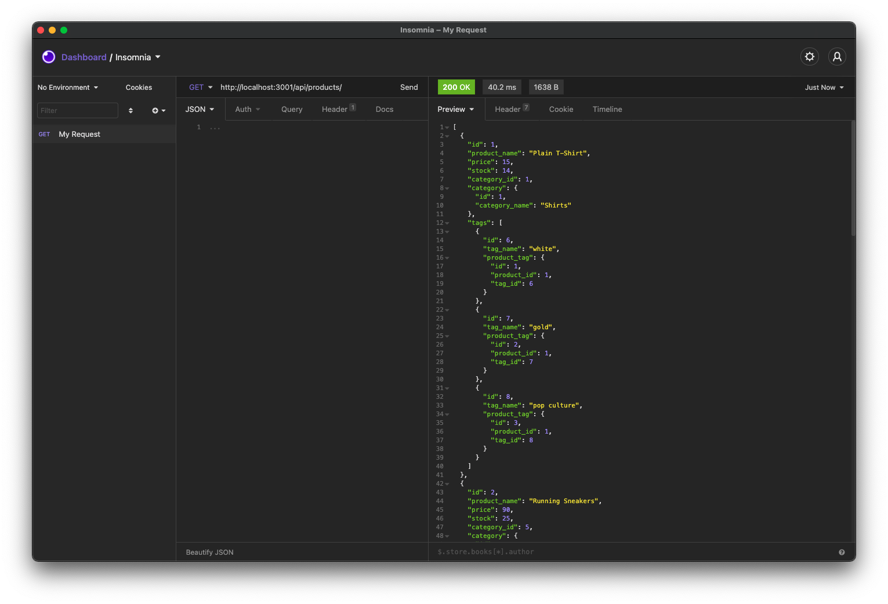
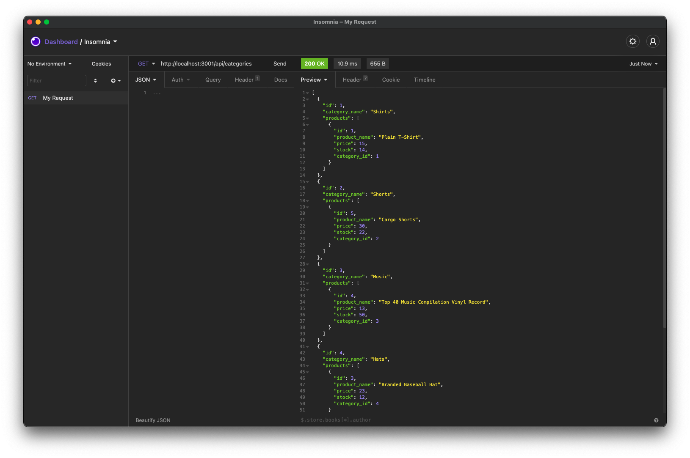

# ECommerce Backend (Node App)

## Description

Node.js app that uses Express, Sequelize, and MySQL to create an API for managing a sample e-commerce database. Starter code provided at the beginning the assignment. I created the database, Sequelize routes, Sequelize models. Tested and troubleshooted API functions using Insomnia Core.

## Table of Contents

- [Installation](#installation)
- [Usage](#usage)
- [Contribute](#contribute)
- [Test](#test)
- [License](#license)
- [Questions](#questions)

## Installation

You begin by running npm install to install Node dependencies. Then create a MySQL database (default ecommerce_db). Next execute the command npm run seed to seed the database with data. Then run npm start to run the API.

## Usage

You can use the app with standard GET, POST, PUT, and DELETE HTTP requests. The API uses JSON to format data.

## Contribute

Anyone is welcome to contribute and suggest improvements.

## Test

The best way to test the app is with a program like Insomnia Core. I used Insomnia to test this app and each route functions as intended.

## Video

For this app, I recorded a video demonstration. Please view the video [here](https://drive.google.com/file/d/1M_CtbBRlF_v69GquJSkVArCQYuXHPRrc/view).

## License

Copyright (c) Sam Gates. All rights reserved.
Licensed under the [MIT](https://opensource.org/licenses/MIT) license.

## Questions

Check out my [GitHub Profile](https://github.com/sg0703).

Email with questions! You can reach me at sam.j.gates@gmail.com.
